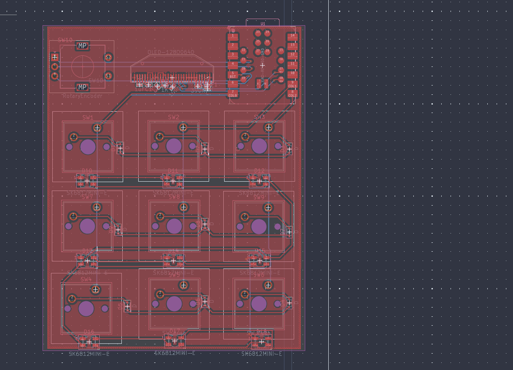
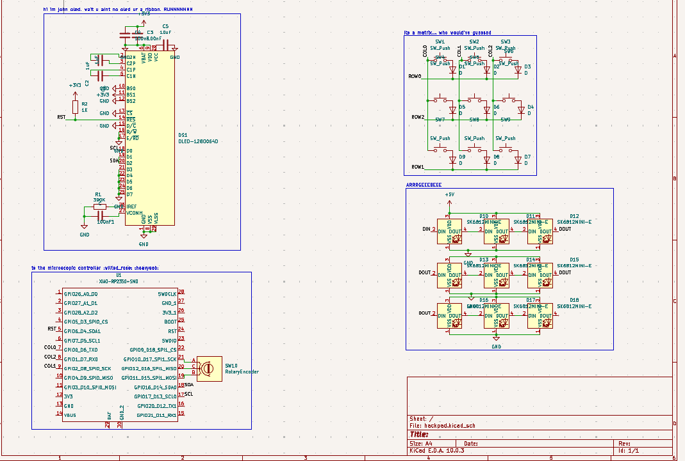
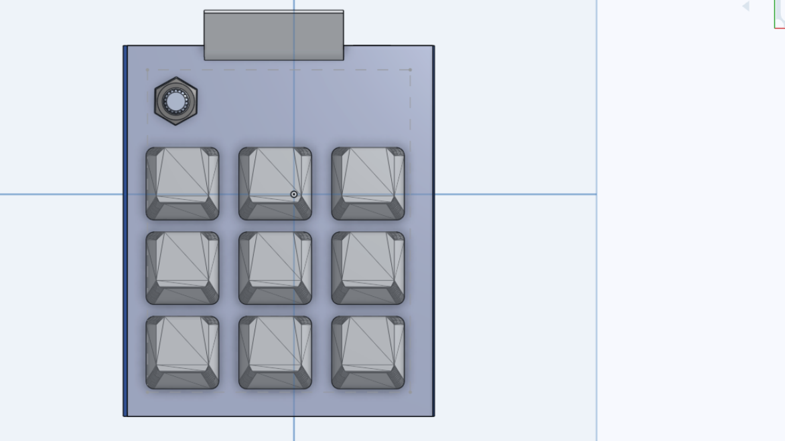
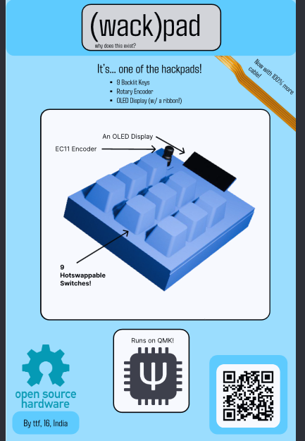

# hackpad!!
a simple 9-key macropad with backlighting

# Why
- ...i've never made one before
- i did actually need a macropad
- i wanted to use a ribbon connector but didn't have anything that needed one
- i needed to remember how to CAD

# Sub(Links)
- [Zine.pdf](zine.pdf)
- [Design](design/)
- [BOM](BOM.csv)
- [Gerbers](gerbers.zip) 
- [Schematic PDF](design/hackpad.pdf)

> DO FLASHING BEFORE ASSEMBLY!
# flashing
- make sure you have QMK installed
- copy the firmware/firmware directory into the keyboards directory of your qmk installation
- run qmk compile -kb wackpad -km default
- on the xiao, ground the BOOT pad while plugging it into the computer
- drop the resultant .uf2 from the previous previous (englishj) step into the flash drive
- after the copying is done (may take a while), the drive will automatically eject
# hardware assembly
- solder the components
- print the case
- place the pcb in the case so the mounting holes go through the stands
- align the OLED ribbon to go through the display hole
- assembly done!

# images

> PCB

>Schematic

> the CAD

> zine img

>pcb 3dview